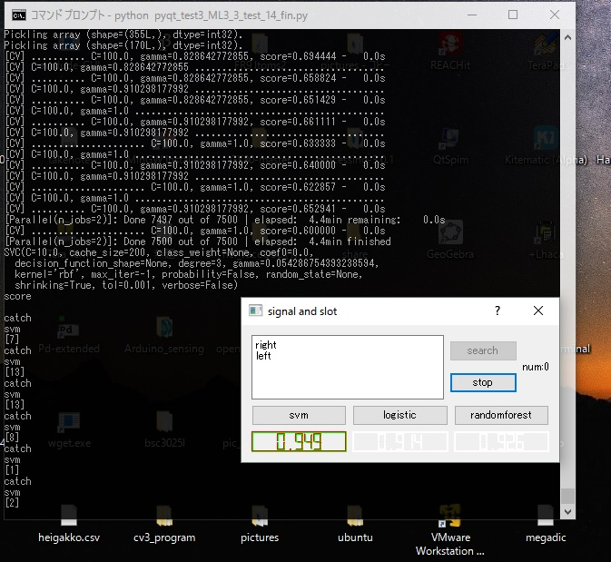
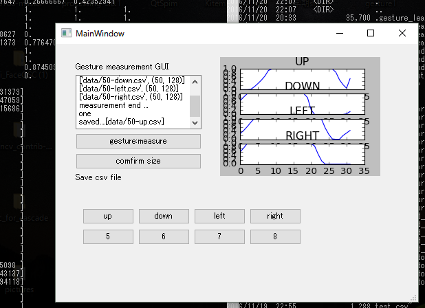

# SVM-gesture  
motion detection of gesture sensor (APDS9960) by using machine learning (Support Vector Machine)  
original library can detect 6motions(not using machine learning)  
<https://www.sparkfun.com/products/12787>

refered page tried to detect 10 motions by using machine learning.   
but failed to scaling fetched data and didn't optimize hyper parameter of SVM(use linear-SVM)  
(but thanks too much this previous research)
<https://github.com/flaket/gesture-machine-learning>
also I modified above problem,and add GUI to convenient controll.
this can detect 14 motions.
AVR refered:<http://makezine.jp/blog/2015/10/apds-9960.html>
#how to use
`python gesture_detect_ML.py`

`python window_gesture_fin.py`

